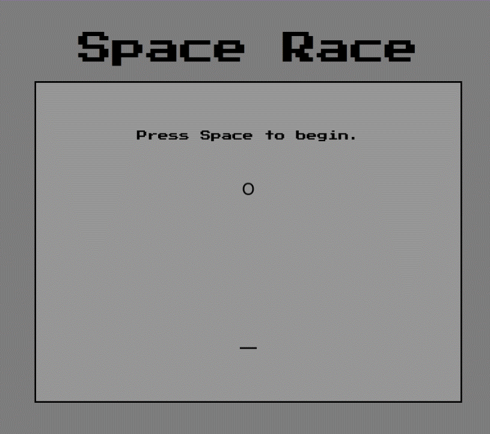

## The Space Race

The Space Race is a top down shooter that evolves as you play, paying homage to the old-school arcade games of the past. The game progresses from Pong-inspired ASCII graphics through Space Invaders and Asteroids, incorporating elements of Tetris/Pacman, before culminating in a 90's aesthetic reminiscent of Metal Slug.

This project began as a collaborative effort during my time at General Assembly, initially built with Ruby on Rails. I was responsible for the game design, asset creation, and sound design, while working with teammates who helped implement the initial Phaser-based gameplay mechanics. 

Since then, I've re-written basically the entire thing, in part to leverage React and game states for better css styling as the levels change, but additionally for simpler hosting, now that Heroku has gone paid.

The vast majority of the sprites and amimations are hand drawn by me, with the exception of maybe 1-2 explosions.

The game won't work on mobile devices and takes approximately 5-10 minutes for a full playthrough (assuming survival!). Here's a quick preview:

Level Progression:
- Lvl 1: Pong, no movement, shoot the alien
- Lvl 2: Invaders/Pong, strafe left and right, shoot the aliens falling at you
- Lvl 3: Space invaders, graphics are updated, aliens now split into children when they die
- Level 4: Space invaders except with vertical movement introduced along with strafing, the player finally gets a ship
- Level 5: Directional shooting introduced
- Level 6: Asteroids! The player unlocks full movement (diagonal included rather than just x/y), the game becomes basically a carbon copy of Asteroids, with asteroids that split when killed etc
- Level 7: Tetris/Pacman, new styles, super bright camp colours, asteroids are now multicoloured tetris blocks of various sizes and colours that split into new, multi-colourd block children.
- Level 8: "Seekers" are introduced, little bug like aliens that chase after you in a kamikaze explosion, an old sorta NES style is introduced
- Level 9: The page styles vaguely similarly to an old CRT monitor, the graphics are updated into mostly their final states, from here it's game changes. Gunners are introduced - ships that spawn shooting bullets where the player was when they spawned, along with the Seekers.
- Level 10: Missile launchers are introduced along with the shooters and seekers. Missile launchers fire missiles that behave like slower seekers, and can overwhelm the screen if not controlled. To make things fairer, the player's firepower is doubled.
- Level 11: The last enemy is added, a shotgunner. It behaves the same as a shooter, but fires a large spread of bullets.
- Level 12: The final level. This never ends, enemies spawn progressively faster until the player dies. To give them a fighting chance, firepower is greatly upgraded into a shotgun of their own, along with a fancy new spaceship.

____

